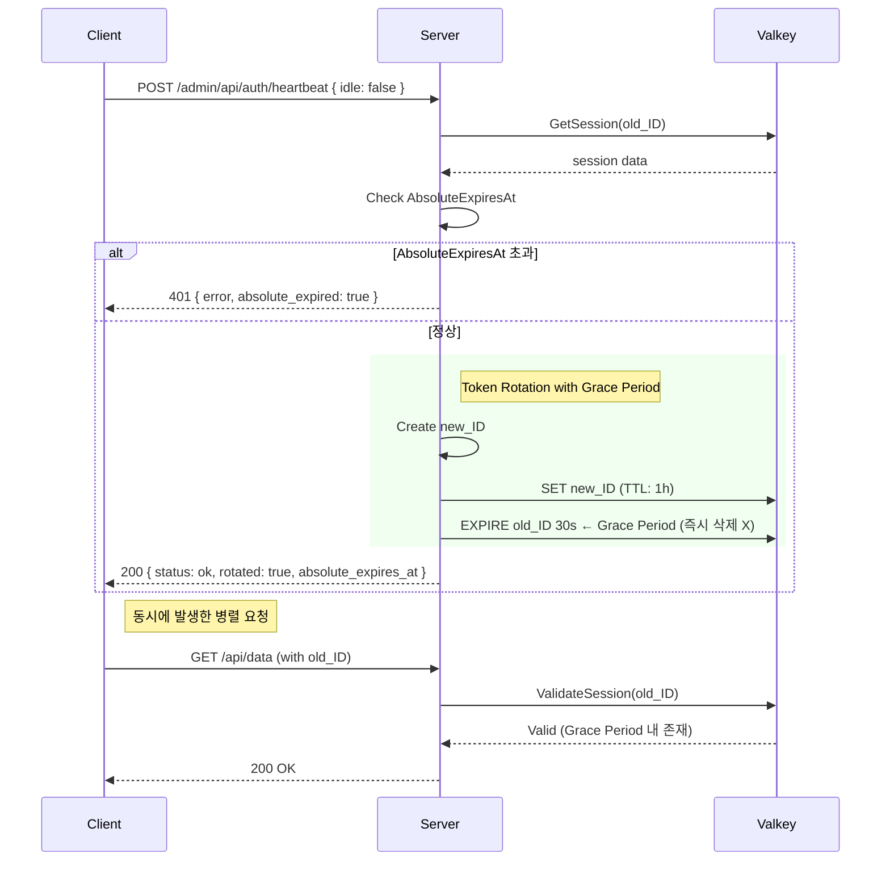
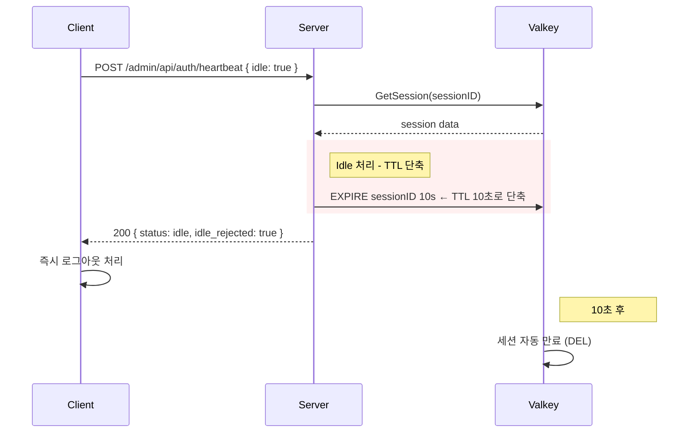

# Admin Session Security (세션 보안)

어드민 대시보드의 세션 관리 및 하트비트 메커니즘에 대한 보안 설계 문서입니다.

> 현재 구현 기준: **admin-dashboard**가 인증/세션을 담당합니다. (`hololive-bot-go`는 `/api/holo/*` 도메인 API만 제공)

---

## 목차

- [개요](#개요)
- [보안 설계 원칙](#보안-설계-원칙)
- [세션 아키텍처](#세션-아키텍처)
- [하트비트 API](#하트비트-api)
- [환경변수](#환경변수)
- [프론트엔드 통합 가이드](#프론트엔드-통합-가이드)
- [OWASP 준수 사항](#owasp-준수-사항)

---

## 개요

어드민 UI는 높은 보안 수준이 요구되므로, 단순한 세션 연장 방식이 아닌 **활동 감지 기반 하트비트**와 **절대 만료 시간**을 적용하여 보안을 강화합니다.

### 핵심 보안 기능

| 기능 | 설명 | 구현 |
|------|------|------|
| **활동 감지 기반 하트비트** | 사용자 활동이 없으면 세션 즉시 만료 유도 | `idle` 플래그 + TTL 단축 |
| **절대 만료 시간 (Absolute Timeout)** | 최초 로그인 후 N시간 경과 시 무조건 재인증 | `AbsoluteExpiresAt` |
| **토큰 갱신 (Token Rotation)** | 하트비트 시 새 세션 ID 발급 + Grace Period | `RotateSession()` |
| **유휴 타임아웃 (Idle Timeout)** | 클라이언트 측 유휴 감지 지원 | 서버 `IdleTimeout` 설정 제공 |

---

## 보안 설계 원칙

### 1. 활동 감지 기반 하트비트

**문제**: 브라우저가 열려 있으면 사용자 활동과 무관하게 세션이 무한정 유지됨

**해결**:
- 클라이언트가 `mousemove`, `keydown`, `click` 등 이벤트를 감지
- 일정 시간 동안 활동이 없으면 하트비트 요청 시 `idle: true` 전송
- 서버는 `idle: true` 요청 시 **세션 TTL을 10초로 단축** (즉시 만료 유도)

```
사용자 활동 있음 → idle: false → 세션 TTL 갱신
사용자 활동 없음 → idle: true  → 세션 TTL 10초로 단축 → 10초 후 자동 만료
```

> **보안 강화**: 단순히 갱신만 거부하면 기존 TTL 동안 세션이 유지됩니다. 
> TTL을 10초로 단축하여 공격자가 탈취한 토큰의 유효 시간을 최소화합니다.

### 2. 절대 만료 시간 (OWASP 권고)

**문제**: 하트비트로 세션이 영원히 연장될 수 있음

**해결**:
- 세션 생성 시 `AbsoluteExpiresAt` 설정 (기본 8시간)
- 하트비트로 **연장 불가**
- 절대 만료 시간 초과 시 무조건 재인증 강제

```go
session := &Session{
    ID:                sessionID,
    CreatedAt:         now,
    ExpiresAt:         now.Add(1 * time.Hour),     // 슬라이딩 TTL
    AbsoluteExpiresAt: now.Add(8 * time.Hour),     // 절대 만료 (연장 불가)
}
```

### 3. 중복 회전 방지 (Grace Period 내 보호)

**문제**: Grace Period 동안 `old_SESSION_ID`로 하트비트 요청이 중복될 경우, 불필요하게 새 세션이 계속 생성됨(Recursive Rotation).

**해결**: 
- `RotateSession` 수행 전 `old_SESSION_ID`의 TTL 확인
- TTL이 Grace Period 범위(30~35초) 이내라면 **이미 회전된 것으로 간주**
- 회전 중단 후 기존 세션 반환 (클라이언트는 200 OK 수신)

### 4. 멀티 탭 TTL 복원

**문제**: 탭 A가 `idle: true`를 보내 TTL을 10초로 단축시켰으나, 탭 B에서 활동이 감지되어 `idle: false`를 보낼 경우.

**해결**:
- `idle: false` (정상 갱신) 요청 시에는 현재 세션의 남은 TTL과 관계없이
- 무조건 `ExpiryDuration` (예: 1시간)으로 **강제 재설정(EXPIRE)**
- 좀비 세션의 부활을 방지하고 정상 사용자의 세션 보장

### 5. 토큰 갱신 (Token Rotation) + Grace Period

**문제 1**: 세션 ID가 탈취되면 공격자가 장기간 악용 가능
**문제 2**: 토큰 갱신 시 기존 세션 즉시 삭제하면 병렬 요청에서 Race Condition 발생

**해결**:
- 하트비트 시 새 세션 ID 발급
- 기존 세션에 **30초 Grace Period** 설정 (즉시 삭제 X)
- 새 세션 쿠키 설정
- `AbsoluteExpiresAt`은 원본 세션 값 유지 (연장 방지)

```
하트비트 요청 → 기존 세션 검증 → 새 세션 생성 → 기존 세션 TTL=30초 설정 → 새 쿠키 설정
```

> **Grace Period**: SPA 환경에서 하트비트와 API 요청이 거의 동시에 발생할 수 있습니다.
> 기존 세션을 30초간 유지하여 진행 중인 요청이 정상 처리되도록 합니다.

### 6. HeartbeatInterval < IdleTimeout 규칙

**문제**: HeartbeatInterval(15분) > IdleTimeout(10분)이면 감지 정확도가 떨어짐

**해결**:
- `HeartbeatInterval` = 5분 (IdleTimeout의 절반)
- 유휴 상태 감지 시 **즉시** 하트비트 전송 (정기 주기 기다리지 않음)

```
HeartbeatInterval(5분) < IdleTimeout(10분)
→ 10분 동안 최소 2번의 하트비트 기회 확보
→ 유휴 감지 정확도 향상
```

---

## 세션 아키텍처

### Session 구조체

```go
// admin-dashboard/backend/internal/auth/auth.go
type Session struct {
    ID                string    `json:"id"`
    CreatedAt         time.Time `json:"created_at"`
    ExpiresAt         time.Time `json:"expires_at"`
    AbsoluteExpiresAt time.Time `json:"absolute_expires_at"`  // OWASP 권고
    LastRotatedAt     time.Time `json:"last_rotated_at,omitempty"`
}
```

### SessionProvider 인터페이스

```go
// admin-dashboard/backend/internal/auth/auth.go
type SessionProvider interface {
    CreateSession(ctx context.Context) (*Session, error)
    GetSession(ctx context.Context, sessionID string) (*Session, error)
    ValidateSession(ctx context.Context, sessionID string) bool
    DeleteSession(ctx context.Context, sessionID string)
    RefreshSession(ctx context.Context, sessionID string) bool  // deprecated
    
    // 새 메서드
    RefreshSessionWithValidation(ctx context.Context, sessionID string, idle bool) (refreshed, absoluteExpired bool, err error)
    RotateSession(ctx context.Context, oldSessionID string) (*Session, error)
}
```

### SessionConfig 설정

```go
// admin-dashboard/backend/internal/config/config.go
var SessionConfig = struct {
    ExpiryDuration   time.Duration  // 슬라이딩 TTL
    AbsoluteTimeout  time.Duration  // 절대 만료 시간
    IdleSessionTTL   time.Duration  // idle=true 시 세션 TTL 단축값
    GracePeriod      time.Duration  // Token Rotation 시 기존 세션 유예 시간
    RotationInterval time.Duration  // Token Rotation 최소 간격
}{
    ExpiryDuration:   30 * time.Minute,
    AbsoluteTimeout:  8 * time.Hour,
    IdleSessionTTL:   10 * time.Second,
    GracePeriod:      30 * time.Second,
    RotationInterval: 15 * time.Minute,
}
```

### API 응답 DTO (JSON 타입 일치)

```go
// admin-dashboard/backend/internal/server/server.go
type heartbeatResponse struct {
    Status            string `json:"status"`
    Rotated           bool   `json:"rotated,omitempty"`
    AbsoluteExpiresAt int64  `json:"absolute_expires_at,omitempty"` // Unix Timestamp (int64)
    IdleRejected      bool   `json:"idle_rejected,omitempty"`
}
```

---

## 하트비트 API

### `POST /admin/api/auth/heartbeat`

세션 TTL을 갱신하고, 선택적으로 토큰을 갱신합니다.

#### Request

```json
{
  "idle": false  // 선택사항, 기본값 false
}
```

| 필드 | 타입 | 필수 | 설명 |
|------|------|------|------|
| `idle` | `boolean` | 선택 | 클라이언트 유휴 상태 여부 |

#### Response (성공 - 활성 상태)

```json
{
  "status": "ok",
  "rotated": true,
  "absolute_expires_at": 1735568988
}
```

| 필드 | 타입 | 설명 |
|------|------|------|
| `status` | `string` | 상태 ("ok") |
| `rotated` | `boolean` | 세션 ID가 갱신되었는지 여부 |
| `absolute_expires_at` | `number` | 절대 만료 시간 (Unix timestamp), rotated=true 시에만 포함 |

#### Response (유휴 상태 - 세션 TTL 단축됨)

```json
{
  "status": "idle",
  "idle_rejected": true
}
```

| 필드 | 타입 | 설명 |
|------|------|------|
| `status` | `string` | 상태 ("idle") |
| `idle_rejected` | `boolean` | 유휴 상태로 인해 갱신이 거부됨 |

> **주의**: `idle_rejected: true` 응답 시 서버에서 세션 TTL을 10초로 단축합니다.
> 클라이언트는 이 응답을 받으면 즉시 로그아웃 처리하거나 경고 모달을 표시해야 합니다.

#### Response (401 - 세션 만료)

```json
{
  "error": "Session expired",
  "absolute_expired": true
}
```

| 필드 | 타입 | 설명 |
|------|------|------|
| `error` | `string` | 에러 메시지 |
| `absolute_expired` | `boolean` | 절대 만료 시간 초과 여부 (true면 재로그인 필요) |

#### Response (500 - 서버 오류)

```json
{
  "error": "Internal server error"
}
```

---

## 환경변수

| 변수명 | 기본값 | 설명 |
|--------|--------|------|
| `SESSION_TOKEN_ROTATION` | `true` | 하트비트 시 세션 ID 갱신 활성화 여부 |

> **참고**: 세션 타임아웃 값들은 `admin-dashboard/backend/internal/config/config.go`의 `SessionConfig`에서 관리됩니다.

---

## 프론트엔드 통합 가이드 (UX 강화)

### 1. Pre-warning (사전 경고) 전략

`idle: true` 전송은 **"확정적 로그아웃"**을 의미하므로, 전송 전에 사용자에게 경고해야 합니다.

```
[9분 경과] (클라이언트 로컬)
→ 경고 모달 표시: "1분 후 자동 로그아웃됩니다. 연장하시겠습니까?"

[사용자 반응 있음] (연장 버튼 클릭 or 활동 감지)
→ 타이머 리셋
→ 서버로 POST /admin/api/auth/heartbeat { idle: false } 전송 (TTL 복원)

[사용자 반응 없음] (1분 추가 경과 = 총 10분)
→ 서버로 POST /admin/api/auth/heartbeat { idle: true } 전송
→ 서버: TTL 10초 단축
→ 클라이언트: 즉시 로그인 페이지로 리다이렉트
```

### 2. 활동 감지 구현

```typescript
// useActivityDetection.ts (9분 경고, 10분 만료)
const WARNING_TIME = 9 * 60 * 1000;
const TIMEOUT_TIME = 10 * 60 * 1000;

// ...
```

### 3. 유휴 감지 시 즉시 하트비트 전송

```typescript
// isIdle 상태 변경 감지하여 즉시 하트비트 전송
useEffect(() => {
  if (isIdle) {
    // 10분이 지나서 완전히 idle 상태가 되면 서버에 통보
    void sendHeartbeat(true)
  }
}, [isIdle, sendHeartbeat])
```

### 4. 하트비트 요청에 idle 플래그 포함

```typescript
const sendHeartbeat = async (idle: boolean) => {
  const response = await fetch('/admin/api/auth/heartbeat', {
    method: 'POST',
    headers: { 'Content-Type': 'application/json' },
    credentials: 'include',
    body: JSON.stringify({ idle }),
  })
  
  const data = await response.json()

  if (!response.ok) {
    if (data.absolute_expired) {
      // 절대 만료 → 즉시 로그아웃
      logout()
    }
    return false
  }

  if (data.idle_rejected) {
    // 이미 Pre-warning 단계를 지났으므로 즉시 로그아웃 처리
    // 서버 TTL이 10초 남았으므로 빠르게 이탈해야 함
    window.location.href = '/login'
    return false
  }

  return true
}
```

### 5. Page Visibility API 활용 (브라우저 스로틀링 대응)

```typescript
// 탭 전환 또는 절전 모드 복귀 시 즉시 하트비트 체크
useEffect(() => {
  const handleVisibilityChange = () => {
    if (document.visibilityState === 'visible') {
      // 탭이 다시 보이면 즉시 하트비트 전송
      void sendHeartbeat(false)
    }
  }

  document.addEventListener('visibilitychange', handleVisibilityChange)
  return () => document.removeEventListener('visibilitychange', handleVisibilityChange)
}, [sendHeartbeat])
```

### 6. 유휴 상태 처리 흐름

```
1. 사용자 활동 감지 → isIdle = false
2. 10분 동안 활동 없음 → isIdle = true
3. 즉시 하트비트 요청: idle: true 전송
4. 서버 처리: 세션 TTL을 10초로 단축
5. 서버 응답: { status: "idle", idle_rejected: true }
6. 클라이언트: 즉시 로그아웃 처리
7. 10초 후: 서버에서 세션 자동 만료
```

### 7. 절대 만료 처리

```typescript
// 응답에서 absolute_expires_at 추적
interface HeartbeatResponse {
  status: string
  rotated?: boolean
  absolute_expires_at?: number  // Unix timestamp
  idle_rejected?: boolean
}

// 절대 만료까지 남은 시간 계산
const remainingSeconds = absoluteExpiresAt - Math.floor(Date.now() / 1000)
if (remainingSeconds < 300) {
  showReloginWarningModal("세션이 5분 후 만료됩니다. 작업을 저장하세요.")
}
```

---

## OWASP 준수 사항

이 구현은 [OWASP Session Management Cheat Sheet](https://cheatsheetseries.owasp.org/cheatsheets/Session_Management_Cheat_Sheet.html)를 준수합니다.

### 적용된 권고사항

| OWASP 권고 | 구현 |
|------------|------|
| **Absolute Timeout** | `AbsoluteExpiresAt` (8시간) |
| **Idle Timeout** | `idle` 플래그 + TTL 10초 단축 (즉시 만료 유도) |
| **Session Regeneration** | `RotateSession()` + Grace Period (30초) |
| **Secure Cookie Flags** | `HttpOnly`, `Secure`, `SameSite=Strict` |
| **HMAC-signed Session ID** | `SignSessionID()` / `ValidateSessionSignature()` |

### 보안 레벨

```
[HIGH] 활동 감지 기반 하트비트 + 즉시 TTL 단축 - 좀비 세션 방지
[HIGH] 클라이언트 측 Idle Timeout - 자리 비움 시 자동 로그아웃
[MED]  절대 만료 시간 - 세션 무한 연장 방지
[MED]  Token Rotation + Grace Period - 세션 탈취 피해 최소화, Race Condition 방지
```

---

## 시퀀스 다이어그램

### 정상 하트비트 흐름 (Token Rotation + Grace Period)



### 유휴 상태 하트비트 흐름 (즉시 만료 유도)



---

## 구현 체크리스트 (Implementation Notes)

개발 시 반드시 확인해야 할 핵심 사항들입니다.

### 1. 핸들러 로직 순서 (Critical)

`HandleHeartbeat`에서 메서드 호출 순서가 매우 중요합니다.

```go
// 올바른 순서 (현재 구현: admin-dashboard/backend/internal/server/server.go)
func (s *Server) handleHeartbeat(c *gin.Context) {
	    // ... 세션 검증 ...

	    // 1️⃣ 먼저 RefreshSessionWithValidation 호출 (TTL 1시간 복원)
	    refreshed, absoluteExpired, err := s.sessions.RefreshSessionWithValidation(ctx, sessionID, req.Idle)
	    if err != nil { /* 에러 처리 */ }

    // 절대 만료 처리
    if absoluteExpired {
        c.JSON(401, gin.H{"error": "Session expired", "absolute_expired": true})
        return
    }

    // 유휴 상태로 갱신 거부됨
    if req.Idle && !refreshed {
        c.JSON(200, heartbeatResponse{Status: "idle", IdleRejected: true})
        return
    }

	    // 2️⃣ 그 다음 RotateSession 호출 (새 세션 ID 발급)
	    if s.cfg.SessionTokenRotation {
	        newSession, rotateErr := s.sessions.RotateSession(ctx, sessionID)
	        if rotateErr == nil {
	            newSignedSessionID := auth.SignSessionID(newSession.ID, s.cfg.AdminSecretKey)
	            auth.SetSecureCookie(c, auth.SessionCookieName, newSignedSessionID, 0, s.cfg.ForceHTTPS)
	            response.Rotated = true
	            response.AbsoluteExpiresAt = newSession.AbsoluteExpiresAt.Unix()
	        }
	    }

    c.JSON(200, response)
}
```

**이유**: 먼저 `RefreshSessionWithValidation`으로 TTL을 1시간으로 복원해야, `RotateSession` 내부의 `ttl <= GracePeriod` 검사(중복 회전 방지)를 통과하여 정상적으로 토큰이 교체됩니다.

> **주의**: 순서가 바뀌면 "자연 만료 임박 세션"이 회전되지 않을 수 있습니다.

---

### 2. 멀티 탭 '팀킬(Team Kill)' 방지

**문제**: 탭 A가 `idle=true`를 보내 TTL을 10초로 줄이면, 활발히 작업 중이던 탭 B가 (하트비트 주기가 오기 전이라면) 10초 뒤에 의도치 않게 로그아웃될 수 있습니다.

**현재 구현** (`admin-dashboard/frontend/src/hooks/useActivityDetection.ts`):

```typescript
const CHANNEL_NAME = 'admin_session'

export function useActivityDetection(idleTimeoutMs: number) {
  const [isIdle, setIsIdle] = useState(false)
  const timeoutRef = useRef<number | null>(null)
  const channelRef = useRef<BroadcastChannel | null>(null)

  // 타이머 리셋 (로컬 전용, 브로드캐스트 안 함)
  const resetTimerInternal = useCallback(() => {
    setIsIdle(false)
    if (timeoutRef.current) window.clearTimeout(timeoutRef.current)
    timeoutRef.current = window.setTimeout(() => setIsIdle(true), idleTimeoutMs)
  }, [idleTimeoutMs])

  // 타이머 리셋 + 다른 탭에 브로드캐스트
  const resetTimer = useCallback(() => {
    resetTimerInternal()
    // 다른 탭에 활동 알림 (BroadcastChannel)
    if (channelRef.current) {
      channelRef.current.postMessage({ type: 'ACTIVITY', timestamp: Date.now() })
    }
  }, [resetTimerInternal])

  // BroadcastChannel 설정
  useEffect(() => {
    // 호환성 체크: 구형 Safari(15.4 미만) 등에서는 미지원
    if (typeof BroadcastChannel === 'undefined') return

    channelRef.current = new BroadcastChannel(CHANNEL_NAME)

    channelRef.current.onmessage = (event) => {
      if (event.data.type === 'ACTIVITY') {
        // 다른 탭에서 활동 감지 → 현재 탭 타이머 리셋
        resetTimerInternal()
      }
    }

    return () => channelRef.current?.close()
  }, [resetTimerInternal])

  // 이벤트 리스너 설정
  useEffect(() => {
    const events = ['mousemove', 'keydown', 'click', 'scroll', 'touchstart']
    events.forEach(event => document.addEventListener(event, resetTimer, { passive: true }))
    resetTimerInternal()
    return () => events.forEach(event => document.removeEventListener(event, resetTimer))
  }, [resetTimer, resetTimerInternal])

  return isIdle
}
```

이 로직으로 **모든 탭이 동시에 Idle 상태일 때만** `idle=true`가 전송되어 안전합니다.

---

### 3. 명시적 로그아웃 처리

사용자가 '로그아웃' 버튼을 직접 눌렀을 때는 Grace Period를 적용하면 **안 됩니다**.

**현재 구현** (`admin-dashboard/backend/internal/server/server.go`):

```go
// handleLogout: 명시적 로그아웃 시 세션 즉시 삭제 (Grace Period 적용 금지)
func (s *Server) handleLogout(c *gin.Context) {
	    signedSessionID, _ := c.Cookie(auth.SessionCookieName)
	    if signedSessionID != "" {
	        // 서명 검증 후 즉시 삭제 (Grace Period 없음)
	        if sessionID, valid := auth.ValidateSessionSignature(signedSessionID, s.cfg.AdminSecretKey); valid {
	            s.sessions.DeleteSession(c.Request.Context(), sessionID)  // 즉시 삭제 (DEL)
	        }
	    }

	    auth.ClearSecureCookie(c, auth.SessionCookieName, s.cfg.ForceHTTPS)

	    c.JSON(200, gin.H{
	        "status":  "ok",
	        "message": "Logout successful",
	    })
	}
```

---

### 4. 시간 단위 변환 (Seconds vs Milliseconds)

| 구분 | 단위 | 예시 |
|------|------|------|
| **백엔드** | Unix Timestamp (초) | `1735568988` |
| **프론트엔드 (JS/TS)** | 밀리초 | `Date.now()` → `1735568988000` |

**현재 구현** (`admin-dashboard/frontend/src/lib/utils.ts`):

```typescript
/**
 * 시간 변환 유틸리티
 * 백엔드: Unix Timestamp (초 단위)
 * 프론트엔드: JavaScript Date / 밀리초 단위
 */

/** Unix timestamp (초) → Date 객체 변환 */
export function unixToDate(unixSeconds: number): Date {
  return new Date(unixSeconds * 1000)
}

/** Unix timestamp (초) → 밀리초 변환 */
export function unixToMs(unixSeconds: number): number {
  return unixSeconds * 1000
}

/** Unix timestamp (초)까지 남은 시간 계산 (밀리초) */
export function getRemainingMs(unixSeconds: number): number {
  return unixSeconds * 1000 - Date.now()
}

/** Unix timestamp (초)까지 남은 시간 계산 (분) */
export function getRemainingMinutes(unixSeconds: number): number {
  return Math.floor(getRemainingMs(unixSeconds) / 1000 / 60)
}
```

**사용 예시**:
```typescript
// 백엔드 응답의 absolute_expires_at 사용
const response = await authApi.heartbeat(false)
if (response.absolute_expires_at) {
  const expiresAt = unixToDate(response.absolute_expires_at)
  const remainingMin = getRemainingMinutes(response.absolute_expires_at)
  
  if (remainingMin < 5) {
    showWarning(`세션이 ${remainingMin}분 후 만료됩니다.`)
  }
}
```

---

### 5. 방어적 코드 (RotateSession 내 중복 회전 방지)

**현재 구현** (`admin-dashboard/backend/internal/auth/auth.go`):

```go
	func (s *ValkeySessionStore) RotateSession(ctx context.Context, oldSessionID string) (*Session, error) {
	    // RotationInterval 내에는 회전하지 않음 (중복 회전 방지)
	    rotationInterval := config.SessionConfig.RotationInterval
	    if !oldSession.LastRotatedAt.IsZero() && time.Since(oldSession.LastRotatedAt) < rotationInterval {
	        return oldSession, nil
	    }

	    // ... 새 세션 생성 및 Grace Period 적용 ...
	}
```

---

## 관련 파일

| 파일 | 설명 |
|------|------|
| `admin-dashboard/backend/internal/config/config.go` | `SessionConfig`, `SESSION_TOKEN_ROTATION` 로드 |
| `admin-dashboard/backend/internal/auth/auth.go` | `Session`, `SessionProvider`, `ValkeySessionStore`, 서명/쿠키 유틸 |
| `admin-dashboard/backend/internal/server/server.go` | `handleLogin`, `handleLogout`, `handleHeartbeat` |
| `admin-dashboard/frontend/src/hooks/useActivityDetection.ts` | 멀티 탭 활동 감지/동기화 |
| `admin-dashboard/frontend/src/lib/utils.ts` | Unix time 변환 유틸 |

---

## 변경 이력

| 날짜 | 변경 내용 |
|------|-----------|
| 2025-12-30 | Grace Period (30초) 추가 - Token Rotation Race Condition 방지 |
| 2025-12-30 | HeartbeatInterval 15분 → 5분으로 단축 (IdleTimeout 절반) |
| 2025-12-30 | idle=true 시 세션 TTL 10초 단축 (즉시 만료 유도) |
| 2025-12-30 | 중복 회전 방지 로직 및 멀티 탭 TTL 복원 명시 |
| 2025-12-30 | 프론트엔드 Pre-warning (사전 경고) 전략 가이드 추가 |
| 2025-12-30 | 구현 체크리스트에 실제 코드 예시 추가 (5개 항목) |
| 2025-12-30 | 방어적 코드 주석 추가 (RotateSession 내 Dead Code 설명) |
